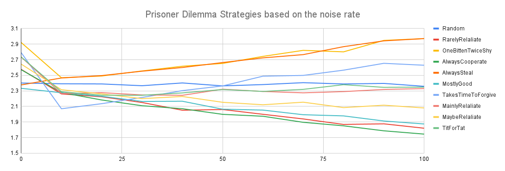

# Prisoner's Dilemma

This is a simulation of emergent behaviour when playing multiple rounds of the [prisoner's dilemma](https://en.wikipedia.org/wiki/Prisoner%27s_dilemma).

In a given round, two players face each other and must each indivually decide whether to cooperate or not (i.e. to steal).

In this version:
  - if both players cooperate, they gain 3 points each
  - if they both decide to not cooperate, they gain 1 point each
  - if one player decides to cooperate, and the other to not cooperate, the cooperator gains 0 pints but the uncooperative partenrs gains 5 points.

Over a series of 200 rounds, two players play each other with the knowledge of what they both did in previous rounds.
Each player has a strategy which can be thought of a mapping of the previous results in this game to a decision to cooperate or steal.
In a season, each player plays each other once, and we find the average points scored by a player in a round.

## Player strategies

I came up with 10 simple strategies:
- Always Cooperate
- Always Steal
- Random
- Rarely Relaliate: cooperate, but if the previous turn the opponent stole, then 10% of the time steal
- Maybe Relaliate: cooperate, but if the previous turn the opponent stole, then 50% of the time steal
- Mainly Relaliate: cooperate, but if the previous turn the opponent stole, then 90% of the time steal
- Tit For Tate: On your first turn cooperate, thewn mirror what your opponent did on the last turn
- Mostly Good: Cooperate 90% of the time, 10% steal
- OnceBittenTwiceShy: cooperate, until your opponent steal, then steal for rest of gamer
- TakesTimeToForgive: Start cooperating, Assume good faith, but if stolen from, steal from opponent until there are two rounds in a row where opponent cooperates then start cooperating again

## Results

When playing with perfect communcation we find reliably that:
- Kind players (those more liekly to communicate) do better overall than unkind ones
- It is far better to be predictable than random
- Players that are not pushovers, (i.e. players that relaliate if their opponent 'steals' from them) do better than those that always cooperate.

MostlyGood - average score: 2.30
AlwaysSteal - average score: 2.39
Random - average score: 2.41
AlwaysCooperate - average score: 2.57
RarelyRelaliate - average score: 2.58
MaybeRelaliate - average score: 2.64
MainlyRelaliate - average score: 2.72
TitForTat - average score: 2.74
TakesTimeToForgive - average score: 2.78
OneBittenTwiceShy - average score: 2.95

## Noise

Noise means that when a player is determining a move for round X, the information they have about what their opponent did in rounds 1 to X-1 are not perfect, so in some percentage of the rounds, their knowledge of what their opponent did is wrong.

Noise is a parameter between 0 and 100. 0 noise represents perfect communication, and 100 means you have completely random view of your's opponent's move. Players do not know what the 'noise' level they are playing in is.

With noise we find that the selfish strategies do a lot better.

